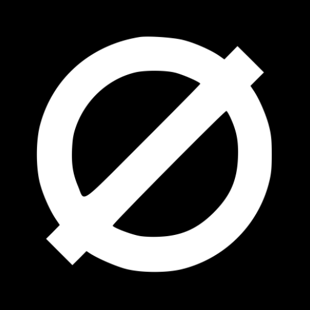

# Zero [](https://travis-ci.com/lucasasselli/Zero)



Zero is an Android live wallpaper app that displays beautiful 3D parallax photos and artworks on your home screen. Oh, and did I've mentioned that is also free and open source?

<br><br><br><br><br>

## Features
- Free and Open Source
- Beautiful High resolution wallpapers
- Advanced customization
- Battery friendly
- Material design interface

## Contributing

### Adding new wallpapers

Wallpapers used by Zero are stored under the `wallpapers` directory as 3 separate files with the same name (the wallpaper id):
- .zip archive containing the parallax layers
- .png thumbnail used for the catalog
- .mp4 animation used as preview

The list of all avilable wallpapers is stored in `wallpapers/catalog.json`.

The wallpaper archive is a .zip file containing the layers used by the wallpaper as separate 5000x5000 .png images. The name of the layers encodes how the layer has to be displayed and how it moves within the wallpaper:

```
<position>_<wallpaper id>_<movement>.png
```

`wallpaper id` is the same value as the archive, thumbnail and animation. The `position` field is an integer numer uses to specify the order of the layers (0 being the most background). `movement` is an integer number used to controll how much the layer is affected by the parallax (0 static, 100 moves a lot!!!).

## Screenshots

<p float="left">
  
   
</p>

## Wallpapers
<p float="left">
  
  
  
   
  
  
  
  
  
  
  
  
  
  
   
  
  
  
    
  
  
    
</p>

## Licensing

Zero is licensed under the [GNU v3 Public License.](license.txt)
